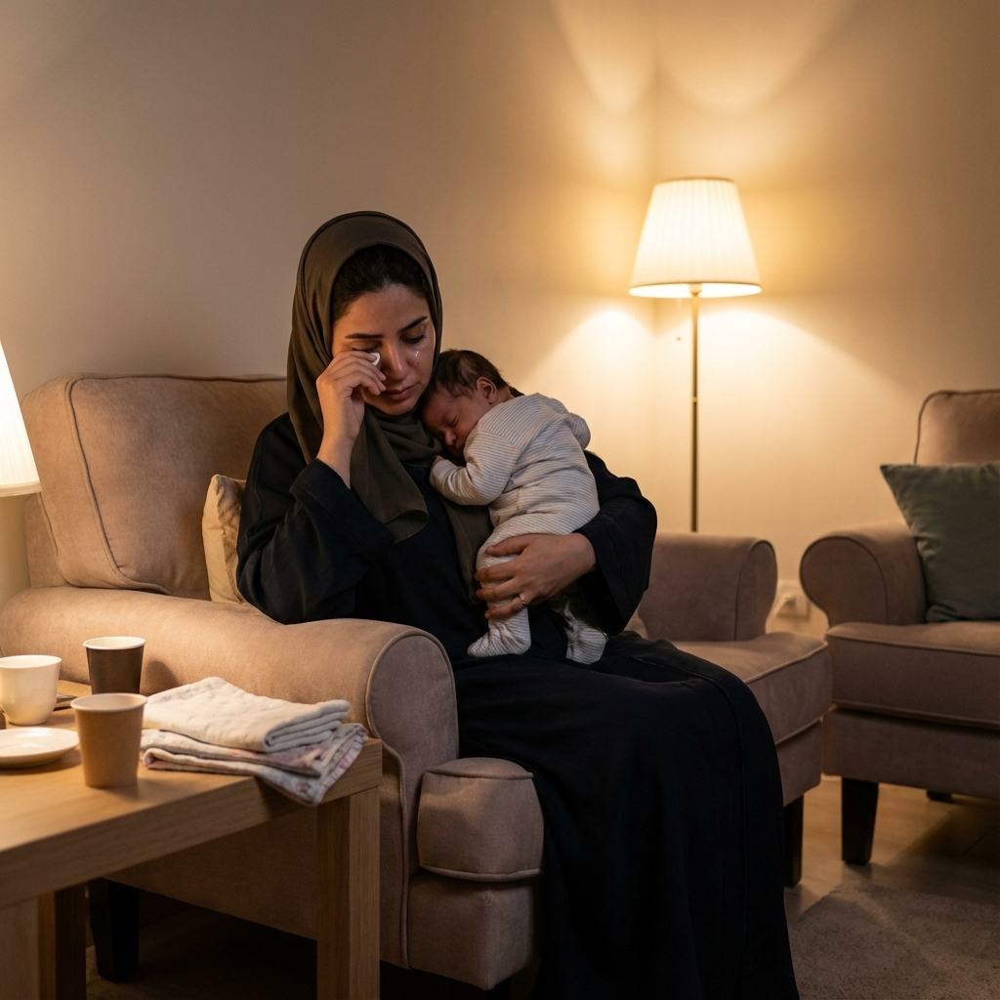
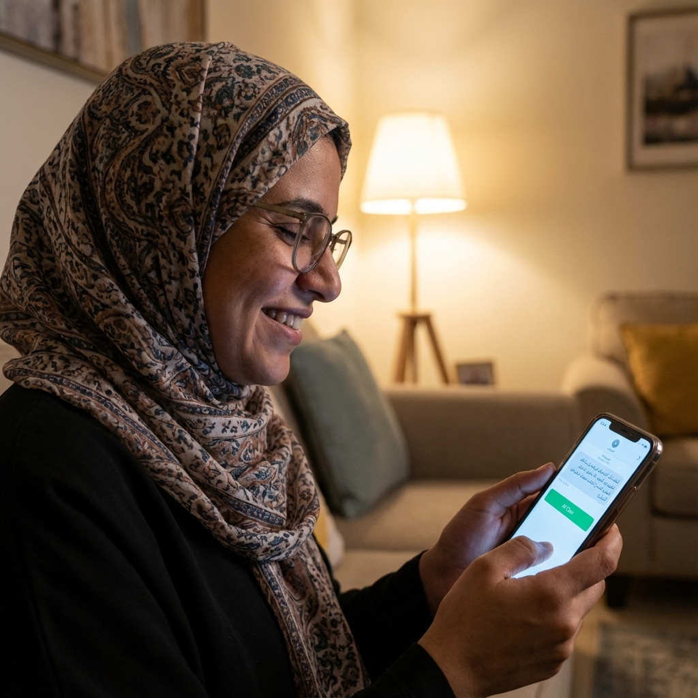

# Campaign: The Silent Struggle
**Format:** Emotional Storytelling Video (30-45 sec)
**Concept:** Highlight the silent pain of women who delay healthcare due to lack of privacy/access to female doctors.

## Scene 1 (0-5 sec)
**Visual:** Black screen.
**Text (Arabic):** "كم مرة قلتي 'أنا بخير' وأنتِ لست كذلك؟"
**Translation:** "How many times did you say 'I'm fine' when you're not?"

## Scene 2 (6-15 sec)
**Visual:** Split-screen or cuts of 3 women.
**Text Overlay:** "67% من النساء لا يجدن طبيبات عند الحاجة" (67% of women can't find female doctors when they need them)

### Shot 1: Professional

*Professional in office, holding stomach in pain, smiling at colleagues.*

### Shot 2: Mother

*Mother at home, exhausted, hiding tears.*

### Shot 3: Student

*Student in cafe, checking phone nervously.*

## Scene 3 (16-30 sec)
**Visual:** Phone screen comes to life showing Marham app, followed by relieved user.
**Text:** "الآن، تحدثي مع طبيبة... من بيتك، بخصوصية تامة" (Now, talk to a female doctor... from home, completely private)

### Shot 4: Resolution

*Woman's face relaxes, she smiles genuinely.*

## Closing (31-45 sec)
**Visual:** App Logo.
**Text:** "مرهم - صحتك أولاً، خصوصيتك مضمونة" (Marham - Your health first, your privacy guaranteed)
**Voiceover:** "حمّلي التطبيق الآن واحصلي على استشارة مجانية" (Download now and get a free consultation)
**CTA:** Download App Store / Play Store
